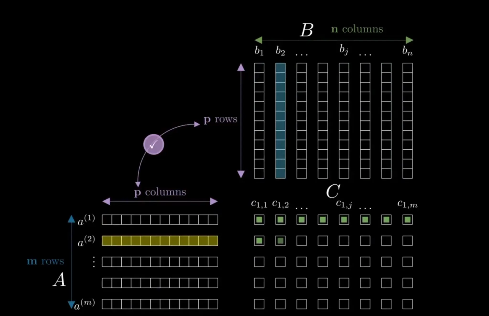

# Matrix Multiplication

> Follow the [LeetGPU repository](https://github.com/HaoyangPing0324/LeetGPU) for more.

## Problem Description


[LeetGPU Challenge](https://leetgpu.com/challenges/matrix-multiplication)

Write a program that multiplies two matrices of 32-bit floating point numbers on a GPU. Given matrix \(A\) of dimensions \(M \times N\) and matrix \(B\) of dimensions \(N \times K\), compute the product matrix \(C = A \times B\), which will have dimensions \(M \times K\). All matrices are stored in row-major format.

### Implementation Requirements

- Use only native features (external libraries are not permitted).
- The `solve` function signature must remain unchanged.
- The final result must be stored in matrix `C`.

### Example 1

Input:

Matrix \(A\) (\(2 \times 2\)):

\[
\begin{bmatrix}
1.0 & 2.0 \\
3.0 & 4.0
\end{bmatrix}
\]

Matrix \(B\) (\(2 \times 2\)):

\[
\begin{bmatrix}
5.0 & 6.0 \\
7.0 & 8.0
\end{bmatrix}
\]

Output:

Matrix \(C\) (\(2 \times 2\)):

\[
\begin{bmatrix}
19.0 & 22.0 \\
43.0 & 50.0
\end{bmatrix}
\]

### Example 2

Input:

Matrix \(A\) (\(1 \times 3\)):

\[
\begin{bmatrix}
1.0 & 2.0 & 3.0
\end{bmatrix}
\]

Matrix \(B\) (\(3 \times 1\)):

\[
\begin{bmatrix}
4.0 \\
5.0 \\
6.0
\end{bmatrix}
\]

Output:

Matrix \(C\) (\(1 \times 1\)):

\[
\begin{bmatrix}
32.0
\end{bmatrix}
\]

### Constraints

- 1 <= `M`, `N`, `K` <= 8192.
- Performance is measured with `M` = 8192, `N` = 6144, `K` = 4096.

## CUDA

### Approach

The challenge multiplies `A[M, N]` by `B[N, K]` and stores `C[M, K]`. One output element is the inner product of a row from `A` and a column from `B`:

\[
C[\text{row},\text{col}]
=
\sum_{\text{inner}=0}^{N-1}
A[\text{row},\text{inner}]
\times
B[\text{inner},\text{col}].
\]

Because the matrices are row-major, the three linear addresses are:

```text
A[row, inner] -> A[row * N + inner]
B[inner, col] -> B[inner * K + col]
C[row, col]   -> C[row * K + col]
```

Every `(row, col)` output coordinate is independent. CUDA therefore parallelizes the two output dimensions, while the reduction over `N` remains inside a thread or a thread-owned output tile.



*One output element combines one row of `A` with one column of `B`.*

<video controls width="760">
  <source src="../assets/02_Matrix_Multiplication/video_01.mp4" type="video/mp4">
  Your Markdown viewer does not support embedded video. Open [the output-element animation](../assets/02_Matrix_Multiplication/video_01.mp4) directly.
</video>

The CUDA files form an optimization sequence. Every version preserves the same `solve(...)` interface and mathematical result. The versions differ in how much output work is assigned to each thread and how data moves through global memory, shared memory, and registers.

### V0: Naive Global-Memory Kernel

#### Approach

V0 launches a two-dimensional grid with `16 x 16` threads per block. Each thread computes its output coordinate as:

```text
row = blockIdx.y * blockDim.y + threadIdx.y
col = blockIdx.x * blockDim.x + threadIdx.x
```

The grid uses ceiling division in both output dimensions. A thread first checks `row < M && col < K`; a valid thread then computes one complete dot product and writes one element of `C`.

This mapping is direct and easy to verify, but it repeatedly fetches reusable data from global memory. Threads in the same output row all need the same row of `A`, while threads in the same output column need the same column of `B`. V0 does not preserve that reuse on chip, so the same values may be loaded many times.

#### Solution

```cuda
#include <cuda_runtime.h>

__global__ void matrix_multiplication_v0(const float* A, const float* B, float* C,
                                         int M, int N, int K) {
    const int row = blockIdx.y * blockDim.y + threadIdx.y;
    const int col = blockIdx.x * blockDim.x + threadIdx.x;
    if (row >= M || col >= K) return;

    float sum = 0.0f;
    for (int inner = 0; inner < N; ++inner) {
        sum += A[row * N + inner] * B[inner * K + col];
    }
    C[row * K + col] = sum;
}

extern "C" void solve(const float* A, const float* B, float* C, int M, int N, int K) {
    const dim3 block(16, 16);
    const dim3 grid((K + block.x - 1) / block.x, (M + block.y - 1) / block.y);
    matrix_multiplication_v0<<<grid, block>>>(A, B, C, M, N, K);
    cudaDeviceSynchronize();
}
```

#### Test Result

| Platform | Status | Average Time | Minimum Time | Maximum Time | Performance |
|---|:---:|---:|---:|---:|---:|
| NVIDIA GeForce RTX 5070 Ti Laptop GPU | PASS | 384.666 ms | 342.381 ms | 445.092 ms | 1071.882 GFLOPS |
| NVIDIA GeForce RTX 4090 | PASS | 83.107 ms | 82.699 ms | 83.530 ms | 4961.253 GFLOPS |

### V1: Original `16 x 16` Shared-Memory Tiling

#### Approach

The original implementation keeps one output element per thread but divides the reduction dimension into tiles of 16. One `16 x 16` block produces one `16 x 16` tile of `C`.

For reduction tile `tile`, thread `(ty, tx)` loads:

```text
A[row, tile * 16 + tx] -> A_shared[ty][tx]
B[tile * 16 + ty, col] -> B_shared[ty][tx]
```

After all 256 threads finish loading, each `A` value is shared by the 16 threads computing different output columns, and each `B` value is shared by the 16 threads computing different output rows. Every thread then performs 16 multiply-add operations:

```text
S += A_shared[ty][inner] * B_shared[inner][tx]
```

<video controls width="760">
  <source src="../assets/02_Matrix_Multiplication/video_02.mp4" type="video/mp4">
  Your Markdown viewer does not support embedded video. Open [the shared-memory tiling animation](../assets/02_Matrix_Multiplication/video_02.mp4) directly.
</video>

Two barriers are necessary for every reduction tile. The first prevents computation from starting before the cooperative load is complete. The second prevents the next tile from overwriting shared memory before every thread has finished using the current tile.

The last reduction tile may be incomplete. Invalid input coordinates are written to shared memory as zero rather than causing an early return. This zero padding contributes nothing to the dot product and lets every thread reach the same barriers, avoiding divergent synchronization. The output store is guarded separately by `row < M && col < K`.

#### Solution

```cuda
#include <cuda_runtime.h>

#define BLOCK_SIZE  16
__global__ void matrix_multiplication_kernel(const float* A, const float* B, float* C, int M, int N,
                                             int K) {
    __shared__ float A_shared[BLOCK_SIZE][BLOCK_SIZE];
    __shared__ float B_shared[BLOCK_SIZE][BLOCK_SIZE];
    int row = threadIdx.y + blockIdx.y * blockDim.y;
    int col = threadIdx.x + blockIdx.x * blockDim.x;
    int tx = threadIdx.x;
    int ty = threadIdx.y;
    float S = 0.0f;
    for (int i = 0 ; i < (N + BLOCK_SIZE - 1) / BLOCK_SIZE ; i++){
        int col2 = tx + i * BLOCK_SIZE;
        int row2 = ty + i * BLOCK_SIZE;
        A_shared[ty][tx] = (row < M && col2 < N) ? A[row * N + col2] : 0.0f;
        B_shared[ty][tx] = (row2 < N && col < K) ? B[row2 * K + col] : 0.0f;
        __syncthreads();
        for (int j = 0 ; j <  BLOCK_SIZE ; j++){
            S += A_shared[ty][j] * B_shared[j][tx];
        }
        __syncthreads();
    }
    if(row < M && col < K){
        C[row * K + col] = S ;
    }
}

extern "C" void solve(const float* A, const float* B, float* C, int M, int N, int K) {
    dim3 threadsPerBlock(16, 16);
    dim3 blocksPerGrid((K + threadsPerBlock.x - 1) / threadsPerBlock.x,
                       (M + threadsPerBlock.y - 1) / threadsPerBlock.y);

    matrix_multiplication_kernel<<<blocksPerGrid, threadsPerBlock>>>(A, B, C, M, N, K);
    cudaDeviceSynchronize();
}
```

#### Test Result

| Platform | Status | Average Time | Minimum Time | Maximum Time | Performance |
|---|:---:|---:|---:|---:|---:|
| NVIDIA GeForce RTX 5070 Ti Laptop GPU | PASS | 242.443 ms | 217.389 ms | 290.510 ms | 1700.675 GFLOPS |
| NVIDIA GeForce RTX 4090 | PASS | 59.324 ms | 58.925 ms | 59.929 ms | 6950.270 GFLOPS |

### V1: One-Dimensional Thread Tiling

#### Approach

The 1D Thread Tiling version uses:

```text
BM = 64
BN = 64
BK = 16
TM = 16
```

One block produces a `64 x 64` output tile. Its dimensions are `(64, 4)`, giving 256 threads. A thread owns one output column and 16 output rows:

```text
row = blockIdx.y * 64 + ty * 16 + local_row
col = blockIdx.x * 64 + tx
```

The 16 partial sums remain in `float sum[16]`. During one reduction step, a thread loads one `B` value from shared memory and reuses it across all 16 accumulators. This increases register reuse and performs more arithmetic per shared-memory access than the one-output-per-thread version.

The block still cooperatively fills `SA[64][16]` and `SB[16][64]`. Flattening the thread index makes loading independent of the output ownership mapping. Bounds are checked during cooperative loads and final stores, so partial tiles remain correct.

#### Solution

```cuda
#include <cuda_runtime.h>

template <int BM = 64, int BN = 64, int BK = 16, int TM = 16>
__global__ void matrix_multiplication_v1_1d(const float* __restrict__ A,
                                            const float* __restrict__ B,
                                            float* __restrict__ C,
                                            int M, int N, int K) {
    constexpr int NT = (BM / TM) * BN;
    __shared__ float SA[BM][BK];
    __shared__ float SB[BK][BN];
    const int tx = threadIdx.x;
    const int ty = threadIdx.y;
    const int tid = ty * blockDim.x + tx;
    const int col = blockIdx.x * BN + tx;
    float sum[TM] = {0.0f};

    for (int tile = 0; tile < N; tile += BK) {
        #pragma unroll
        for (int i = tid; i < BM * BK; i += NT) {
            const int local_row = i / BK;
            const int local_col = i % BK;
            const int row = blockIdx.y * BM + local_row;
            const int inner = tile + local_col;
            SA[local_row][local_col] =
                (row < M && inner < N) ? A[row * N + inner] : 0.0f;
        }
        #pragma unroll
        for (int i = tid; i < BK * BN; i += NT) {
            const int local_row = i / BN;
            const int local_col = i % BN;
            const int inner = tile + local_row;
            const int output_col = blockIdx.x * BN + local_col;
            SB[local_row][local_col] =
                (inner < N && output_col < K) ? B[inner * K + output_col] : 0.0f;
        }
        __syncthreads();

        #pragma unroll
        for (int inner = 0; inner < BK; ++inner) {
            const float b = SB[inner][tx];
            #pragma unroll
            for (int row = 0; row < TM; ++row) {
                sum[row] += SA[ty * TM + row][inner] * b;
            }
        }
        __syncthreads();
    }

    #pragma unroll
    for (int local_row = 0; local_row < TM; ++local_row) {
        const int row = blockIdx.y * BM + ty * TM + local_row;
        if (row < M && col < K) C[row * K + col] = sum[local_row];
    }
}

extern "C" void solve(const float* A, const float* B, float* C, int M, int N, int K) {
    constexpr int BM = 64, BN = 64, BK = 16, TM = 16;
    const dim3 block(BN, BM / TM);
    const dim3 grid((K + BN - 1) / BN, (M + BM - 1) / BM);
    matrix_multiplication_v1_1d<BM, BN, BK, TM><<<grid, block>>>(A, B, C, M, N, K);
    cudaDeviceSynchronize();
}
```

#### Test Result

| Platform | Status | Average Time | Minimum Time | Maximum Time | Performance |
|---|:---:|---:|---:|---:|---:|
| NVIDIA GeForce RTX 5070 Ti Laptop GPU | PASS | 78.838 ms | 65.303 ms | 100.539 ms | 5229.916 GFLOPS |
| NVIDIA GeForce RTX 4090 | PASS | 19.505 ms | 19.444 ms | 19.528 ms | 21138.901 GFLOPS |

### V1: Two-Dimensional Thread Tiling

#### Approach

The 2D Thread Tiling version uses:

```text
BM = 64
BN = 64
BK = 16
TM = 8
TN = 4
```

The block dimensions are `(16, 8)`, or 128 threads. Each thread owns an `8 x 4` micro-tile containing 32 output elements:

```text
row = blockIdx.y * 64 + ty * 8 + local_row
col = blockIdx.x * 64 + tx * 4 + local_col
```

For one reduction position, the thread loads eight `A` values and four `B` values from shared memory into registers. Their outer product updates all 32 accumulators. Each `A` register contributes to four output columns, and each `B` register contributes to eight output rows. The thread therefore performs 32 multiply-add operations from only 12 shared-memory scalar loads.

This is the central benefit of two-dimensional thread tiling: the mathematical work is unchanged, but both operands are reused in registers before another shared-memory access is required.

#### Solution

```cuda
#include <cuda_runtime.h>

template <int BM = 64, int BN = 64, int BK = 16, int TM = 8, int TN = 4>
__global__ void matrix_multiplication_v1_2d(const float* __restrict__ A,
                                            const float* __restrict__ B,
                                            float* __restrict__ C,
                                            int M, int N, int K) {
    constexpr int NT = (BM / TM) * (BN / TN);
    __shared__ float SA[BM][BK];
    __shared__ float SB[BK][BN];
    const int tx = threadIdx.x;
    const int ty = threadIdx.y;
    const int tid = ty * blockDim.x + tx;
    float sum[TM][TN] = {{0.0f}};

    for (int tile = 0; tile < (N + BK - 1) / BK; ++tile) {
        const int base_inner = tile * BK;
        #pragma unroll
        for (int i = tid; i < BM * BK; i += NT) {
            const int local_row = i / BK;
            const int local_col = i % BK;
            const int row = blockIdx.y * BM + local_row;
            const int inner = base_inner + local_col;
            SA[local_row][local_col] =
                (row < M && inner < N) ? A[row * N + inner] : 0.0f;
        }
        #pragma unroll
        for (int i = tid; i < BK * BN; i += NT) {
            const int local_row = i / BN;
            const int local_col = i % BN;
            const int inner = base_inner + local_row;
            const int col = blockIdx.x * BN + local_col;
            SB[local_row][local_col] =
                (inner < N && col < K) ? B[inner * K + col] : 0.0f;
        }
        __syncthreads();

        #pragma unroll
        for (int inner = 0; inner < BK; ++inner) {
            float a_reg[TM], b_reg[TN];
            #pragma unroll
            for (int row = 0; row < TM; ++row) a_reg[row] = SA[ty * TM + row][inner];
            #pragma unroll
            for (int col = 0; col < TN; ++col) b_reg[col] = SB[inner][tx * TN + col];
            #pragma unroll
            for (int row = 0; row < TM; ++row)
                #pragma unroll
                for (int col = 0; col < TN; ++col)
                    sum[row][col] += a_reg[row] * b_reg[col];
        }
        __syncthreads();
    }

    #pragma unroll
    for (int local_row = 0; local_row < TM; ++local_row) {
        const int row = blockIdx.y * BM + ty * TM + local_row;
        if (row >= M) continue;
        #pragma unroll
        for (int local_col = 0; local_col < TN; ++local_col) {
            const int col = blockIdx.x * BN + tx * TN + local_col;
            if (col < K) C[row * K + col] = sum[local_row][local_col];
        }
    }
}

extern "C" void solve(const float* A, const float* B, float* C, int M, int N, int K) {
    constexpr int BM = 64, BN = 64, BK = 16, TM = 8, TN = 4;
    const dim3 block(BN / TN, BM / TM);
    const dim3 grid((K + BN - 1) / BN, (M + BM - 1) / BM);
    matrix_multiplication_v1_2d<BM, BN, BK, TM, TN><<<grid, block>>>(A, B, C, M, N, K);
    cudaDeviceSynchronize();
}
```

#### Test Result

| Platform | Status | Average Time | Minimum Time | Maximum Time | Performance |
|---|:---:|---:|---:|---:|---:|
| NVIDIA GeForce RTX 5070 Ti Laptop GPU | PASS | 53.735 ms | 50.348 ms | 70.620 ms | 7673.130 GFLOPS |
| NVIDIA GeForce RTX 4090 | PASS | 13.354 ms | 12.488 ms | 13.925 ms | 30875.503 GFLOPS |

### V2: Vectorized `float4` Transfers (`BK = 32`)

#### Approach

V2 retains the `8 x 4` register micro-tile and changes the reduction tile to `BK = 32`. It uses `float4` for four adjacent values at a time in:

- global-memory loads from `A` and `B`;
- stores into shared memory;
- shared-memory reads of adjacent `B` values;
- final stores to adjacent columns of `C`.

A vector load is valid only when its address is suitably aligned and all four elements exist. The vectorized kernel is therefore selected only when `N` and `K` are divisible by four. When either condition is false, `solve(...)` launches the scalar safe implementation. This fallback is necessary for the general LeetGPU interface; vectorization must not trade away correctness on irregular shapes.

Within the optimized path, output rows in the final block are still guarded independently. Because `K` is a multiple of four, a valid four-column group is either fully inside the matrix or fully outside it.

Vectorization reduces the number of memory instructions, but it does not reduce the required \(2MNK\) floating-point operations. Its benefit depends on alignment, instruction issue, and the balance between memory movement and arithmetic.

#### Solution

```cuda
#include <cuda_runtime.h>

#ifndef MATMUL_V2_BM
#define MATMUL_V2_BM 64
#endif
#ifndef MATMUL_V2_BN
#define MATMUL_V2_BN 64
#endif
#ifndef MATMUL_V2_BK
#define MATMUL_V2_BK 32
#endif
#ifndef MATMUL_V2_TM
#define MATMUL_V2_TM 8
#endif
#ifndef MATMUL_V2_TN
#define MATMUL_V2_TN 4
#endif

__global__ void scalar_fallback(const float* A, const float* B, float* C,
                                int M, int N, int K) {
    const int row = blockIdx.y * blockDim.y + threadIdx.y;
    const int col = blockIdx.x * blockDim.x + threadIdx.x;
    if (row >= M || col >= K) return;
    float sum = 0.0f;
    for (int inner = 0; inner < N; ++inner) {
        sum += A[row * N + inner] * B[inner * K + col];
    }
    C[row * K + col] = sum;
}

template <int BM = MATMUL_V2_BM, int BN = MATMUL_V2_BN,
          int BK = MATMUL_V2_BK, int TM = MATMUL_V2_TM,
          int TN = MATMUL_V2_TN>
__global__ void matrix_multiplication_v2(const float* __restrict__ A,
                                         const float* __restrict__ B,
                                         float* __restrict__ C,
                                         int M, int N, int K) {
    static_assert(BK % 4 == 0 && BN % 4 == 0 && TN % 4 == 0,
                  "Vectorized dimensions must be multiples of four");
    constexpr int NT = (BM / TM) * (BN / TN);
    __shared__ float SA[BM][BK];
    __shared__ float SB[BK][BN];
    const int tx = threadIdx.x;
    const int ty = threadIdx.y;
    const int tid = ty * blockDim.x + tx;
    float sum[TM][TN] = {{0.0f}};

    for (int tile = 0; tile < (N + BK - 1) / BK; ++tile) {
        const int base_inner = tile * BK;
        #pragma unroll
        for (int i = tid; i < BM * BK / 4; i += NT) {
            const int local_row = i / (BK / 4);
            const int local_col = (i % (BK / 4)) * 4;
            const int row = blockIdx.y * BM + local_row;
            const int inner = base_inner + local_col;
            float4 value = make_float4(0, 0, 0, 0);
            if (row < M && inner + 3 < N) {
                value = *reinterpret_cast<const float4*>(&A[row * N + inner]);
            }
            *reinterpret_cast<float4*>(&SA[local_row][local_col]) = value;
        }
        #pragma unroll
        for (int i = tid; i < BK * BN / 4; i += NT) {
            const int local_row = i / (BN / 4);
            const int local_col = (i % (BN / 4)) * 4;
            const int inner = base_inner + local_row;
            const int col = blockIdx.x * BN + local_col;
            float4 value = make_float4(0, 0, 0, 0);
            if (inner < N && col + 3 < K) {
                value = *reinterpret_cast<const float4*>(&B[inner * K + col]);
            }
            *reinterpret_cast<float4*>(&SB[local_row][local_col]) = value;
        }
        __syncthreads();

        #pragma unroll
        for (int inner = 0; inner < BK; ++inner) {
            const float4 b = *reinterpret_cast<const float4*>(&SB[inner][tx * TN]);
            #pragma unroll
            for (int row = 0; row < TM; ++row) {
                const float a = SA[ty * TM + row][inner];
                sum[row][0] += a * b.x;
                sum[row][1] += a * b.y;
                sum[row][2] += a * b.z;
                sum[row][3] += a * b.w;
            }
        }
        __syncthreads();
    }

    #pragma unroll
    for (int local_row = 0; local_row < TM; ++local_row) {
        const int row = blockIdx.y * BM + ty * TM + local_row;
        const int col = blockIdx.x * BN + tx * TN;
        if (row < M && col + 3 < K) {
            *reinterpret_cast<float4*>(&C[row * K + col]) =
                make_float4(sum[local_row][0], sum[local_row][1],
                            sum[local_row][2], sum[local_row][3]);
        }
    }
}

extern "C" void solve(const float* A, const float* B, float* C, int M, int N, int K) {
    if ((N & 3) != 0 || (K & 3) != 0) {
        const dim3 block(16, 16);
        const dim3 grid((K + 15) / 16, (M + 15) / 16);
        scalar_fallback<<<grid, block>>>(A, B, C, M, N, K);
    } else {
        constexpr int BM = MATMUL_V2_BM, BN = MATMUL_V2_BN;
        constexpr int BK = MATMUL_V2_BK, TM = MATMUL_V2_TM;
        constexpr int TN = MATMUL_V2_TN;
        const dim3 block(BN / TN, BM / TM);
        const dim3 grid((K + BN - 1) / BN, (M + BM - 1) / BM);
        matrix_multiplication_v2<BM, BN, BK, TM, TN>
            <<<grid, block>>>(A, B, C, M, N, K);
    }
    cudaDeviceSynchronize();
}
```

#### Test Result

| Platform | Status | Average Time | Minimum Time | Maximum Time | Performance |
|---|:---:|---:|---:|---:|---:|
| NVIDIA GeForce RTX 5070 Ti Laptop GPU | PASS | 37.630 ms | 33.509 ms | 40.608 ms | 10957.192 GFLOPS |
| NVIDIA GeForce RTX 4090 | PASS | 11.526 ms | 11.359 ms | 11.717 ms | 35773.893 GFLOPS |

### V2 Control: Vectorized Single Buffer (`BK = 16`)

#### Approach

This control version compiles the same single-buffered V2 kernel with `BK = 16`, matching the reduction-tile depth used by V3. All other V2 work ownership, vectorized transfers, register micro-tile, boundary fallback, and launch geometry remain unchanged.

The matched configuration separates the effect of reduction-tile depth from the effect of double buffering. On both tested GPUs, the single-buffered `BK = 16` control remains faster than V3. Therefore, V3's lower measured performance cannot be explained only by comparing V2's original `BK = 32` against V3's `BK = 16`; the additional prefetch registers, two shared-memory buffers, buffer switching, and synchronization also fail to repay their cost in this implementation.

#### Solution

```cuda
#define MATMUL_V2_BK 16

#include "02_Matrix_Multiplication_v2_vectorized.cu"
```

#### Test Result

| Platform | Status | Average Time | Minimum Time | Maximum Time | Performance |
|---|:---:|---:|---:|---:|---:|
| NVIDIA GeForce RTX 5070 Ti Laptop GPU | PASS | 38.951 ms | 36.741 ms | 41.201 ms | 10585.661 GFLOPS |
| NVIDIA GeForce RTX 4090 | PASS | 11.035 ms | 10.414 ms | 11.805 ms | 37364.875 GFLOPS |

### V2 Control: Vectorized Single Buffer (`128 x 128`)

#### Approach

This control keeps the V2 single-buffered algorithm and changes only the compile-time tile parameters to `BM = 128`, `BN = 128`, and `BK = 16`. The per-thread `8 x 4` micro-tile, `float4` transfers, scalar boundary fallback, and accumulation logic remain unchanged.

The block grows from 128 to 512 threads and produces four times as many output elements, but the larger tile does not improve this single-buffered kernel. It is slower than the matched `64 x 64`, `BK = 16` control on both tested GPUs. The extra block-level reuse is therefore insufficient by itself to offset the larger block's scheduling and resource costs.

#### Solution

```cuda
#define MATMUL_V2_BM 128
#define MATMUL_V2_BN 128
#define MATMUL_V2_BK 16
#define MATMUL_V2_TM 8
#define MATMUL_V2_TN 4

#include "02_Matrix_Multiplication_v2_vectorized.cu"
```

#### Test Result

| Platform | Status | Average Time | Minimum Time | Maximum Time | Performance |
|---|:---:|---:|---:|---:|---:|
| NVIDIA GeForce RTX 5070 Ti Laptop GPU | PASS | 44.230 ms | 42.647 ms | 47.437 ms | 9322.085 GFLOPS |
| NVIDIA GeForce RTX 4090 | PASS | 12.730 ms | 12.409 ms | 13.177 ms | 32389.696 GFLOPS |

### V3: Register Prefetch and Double-Buffered Shared Memory

#### Base `64 x 64` Configuration

##### Approach

V3 uses:

```text
BM = 64
BN = 64
BK = 16
TM = 8
TN = 4
```

It allocates two copies of each shared-memory tile:

```text
SA[2][64][16]
SB[2][16][64]
```

The first tile is loaded before the main loop. For each later tile, a thread first issues global loads into private prefetch registers. It then computes from the current shared-memory buffer, waits until all threads have finished consuming that buffer, writes the prefetched values into the alternate buffer, and finally synchronizes before exchanging the read and write buffer indices.

The intended pipeline is:

```text
tile i + 1: global memory -> prefetch registers
tile i:     shared memory -> accumulator registers
tile i + 1: prefetch registers -> alternate shared-memory buffer
```

This is software double buffering with register prefetch, not an asynchronous `cp.async` pipeline. The global loads are issued before the current tile is consumed, giving the compiler and GPU an opportunity to overlap outstanding memory operations with independent arithmetic. However, the implementation still needs block-wide barriers when a shared buffer changes roles.

Double buffering is not automatically faster. It doubles shared-memory storage and adds prefetch registers, control flow, a pipeline prologue, and an epilogue. Those costs can reduce occupancy or offset hidden latency. In the measured workload, V3 is slightly slower than V2 on both tested GPUs, so the document reports it as a verified optimization experiment rather than claiming an improvement that was not observed.

##### Solution

```cuda
#include <cuda_runtime.h>

#ifndef MATMUL_BM
#define MATMUL_BM 64
#define MATMUL_BN 64
#define MATMUL_BK 16
#define MATMUL_TM 8
#define MATMUL_TN 4
#endif

__global__ void scalar_fallback_v3(const float* A, const float* B, float* C,
                                   int M, int N, int K) {
    const int row = blockIdx.y * blockDim.y + threadIdx.y;
    const int col = blockIdx.x * blockDim.x + threadIdx.x;
    if (row >= M || col >= K) return;
    float sum = 0.0f;
    for (int inner = 0; inner < N; ++inner) {
        sum += A[row * N + inner] * B[inner * K + col];
    }
    C[row * K + col] = sum;
}

template <int BM = 64, int BN = 64, int BK = 16, int TM = 8, int TN = 4>
__global__ void matrix_multiplication_v3(const float* __restrict__ A,
                                         const float* __restrict__ B,
                                         float* __restrict__ C,
                                         int M, int N, int K) {
    constexpr int NT = (BM / TM) * (BN / TN);
    constexpr int A_FLOAT4_PER_THREAD = (BM * BK / 4 + NT - 1) / NT;
    constexpr int B_FLOAT4_PER_THREAD = (BK * BN / 4 + NT - 1) / NT;
    __shared__ float SA[2][BM][BK];
    __shared__ float SB[2][BK][BN];

    const int tx = threadIdx.x;
    const int ty = threadIdx.y;
    const int tid = ty * blockDim.x + tx;
    float a_prefetch[A_FLOAT4_PER_THREAD][4];
    float b_prefetch[B_FLOAT4_PER_THREAD][4];
    float sum[TM][TN] = {{0.0f}};

    auto load_tile = [&](int tile) {
        const int base_inner = tile * BK;
        #pragma unroll
        for (int i = 0; i < A_FLOAT4_PER_THREAD; ++i) {
            const int index = (i * NT + tid) * 4;
            float4 value = make_float4(0, 0, 0, 0);
            if (index < BM * BK) {
                const int local_row = index / BK;
                const int local_col = index % BK;
                const int row = blockIdx.y * BM + local_row;
                const int inner = base_inner + local_col;
                if (row < M && inner + 3 < N) {
                    value = *reinterpret_cast<const float4*>(&A[row * N + inner]);
                }
            }
            a_prefetch[i][0] = value.x; a_prefetch[i][1] = value.y;
            a_prefetch[i][2] = value.z; a_prefetch[i][3] = value.w;
        }
        #pragma unroll
        for (int i = 0; i < B_FLOAT4_PER_THREAD; ++i) {
            const int index = (i * NT + tid) * 4;
            float4 value = make_float4(0, 0, 0, 0);
            if (index < BK * BN) {
                const int local_row = index / BN;
                const int local_col = index % BN;
                const int inner = base_inner + local_row;
                const int col = blockIdx.x * BN + local_col;
                if (inner < N && col + 3 < K) {
                    value = *reinterpret_cast<const float4*>(&B[inner * K + col]);
                }
            }
            b_prefetch[i][0] = value.x; b_prefetch[i][1] = value.y;
            b_prefetch[i][2] = value.z; b_prefetch[i][3] = value.w;
        }
    };

    auto store_tile = [&](int buffer) {
        #pragma unroll
        for (int i = 0; i < A_FLOAT4_PER_THREAD; ++i) {
            const int index = (i * NT + tid) * 4;
            if (index < BM * BK) {
                const int local_row = index / BK;
                const int local_col = index % BK;
                *reinterpret_cast<float4*>(&SA[buffer][local_row][local_col]) =
                    make_float4(a_prefetch[i][0], a_prefetch[i][1],
                                a_prefetch[i][2], a_prefetch[i][3]);
            }
        }
        #pragma unroll
        for (int i = 0; i < B_FLOAT4_PER_THREAD; ++i) {
            const int index = (i * NT + tid) * 4;
            if (index < BK * BN) {
                const int local_row = index / BN;
                const int local_col = index % BN;
                *reinterpret_cast<float4*>(&SB[buffer][local_row][local_col]) =
                    make_float4(b_prefetch[i][0], b_prefetch[i][1],
                                b_prefetch[i][2], b_prefetch[i][3]);
            }
        }
    };

    const int tiles = (N + BK - 1) / BK;
    load_tile(0);
    store_tile(0);
    __syncthreads();

    int read_buffer = 0;
    for (int tile = 0; tile < tiles; ++tile) {
        if (tile + 1 < tiles) load_tile(tile + 1);

        #pragma unroll
        for (int inner = 0; inner < BK; ++inner) {
            #pragma unroll
            for (int local_col = 0; local_col < TN; local_col += 4) {
                const float4 b = *reinterpret_cast<const float4*>(
                    &SB[read_buffer][inner][tx * TN + local_col]);
                #pragma unroll
                for (int row = 0; row < TM; ++row) {
                    const float a = SA[read_buffer][ty * TM + row][inner];
                    sum[row][local_col + 0] += a * b.x;
                    sum[row][local_col + 1] += a * b.y;
                    sum[row][local_col + 2] += a * b.z;
                    sum[row][local_col + 3] += a * b.w;
                }
            }
        }
        __syncthreads();

        if (tile + 1 < tiles) {
            const int write_buffer = read_buffer ^ 1;
            store_tile(write_buffer);
            __syncthreads();
            read_buffer = write_buffer;
        }
    }

    #pragma unroll
    for (int local_row = 0; local_row < TM; ++local_row) {
        const int row = blockIdx.y * BM + ty * TM + local_row;
        #pragma unroll
        for (int local_col = 0; local_col < TN; local_col += 4) {
            const int col = blockIdx.x * BN + tx * TN + local_col;
            if (row < M && col + 3 < K) {
                *reinterpret_cast<float4*>(&C[row * K + col]) =
                    make_float4(sum[local_row][local_col + 0],
                                sum[local_row][local_col + 1],
                                sum[local_row][local_col + 2],
                                sum[local_row][local_col + 3]);
            }
        }
    }
}

#ifndef MATMUL_NO_SOLVE
extern "C" void solve(const float* A, const float* B, float* C, int M, int N, int K) {
    if ((N & 3) != 0 || (K & 3) != 0) {
        const dim3 block(16, 16);
        const dim3 grid((K + 15) / 16, (M + 15) / 16);
        scalar_fallback_v3<<<grid, block>>>(A, B, C, M, N, K);
    } else {
        constexpr int BM = MATMUL_BM, BN = MATMUL_BN, BK = MATMUL_BK;
        constexpr int TM = MATMUL_TM, TN = MATMUL_TN;
        const dim3 block(BN / TN, BM / TM);
        const dim3 grid((K + BN - 1) / BN, (M + BM - 1) / BM);
        matrix_multiplication_v3<BM, BN, BK, TM, TN>
            <<<grid, block>>>(A, B, C, M, N, K);
    }
    cudaDeviceSynchronize();
}
#endif
```

##### Test Result

| Platform | Status | Average Time | Minimum Time | Maximum Time | Performance |
|---|:---:|---:|---:|---:|---:|
| NVIDIA GeForce RTX 5070 Ti Laptop GPU | PASS | 39.856 ms | 38.156 ms | 41.806 ms | 10345.265 GFLOPS |
| NVIDIA GeForce RTX 4090 | PASS | 12.214 ms | 11.304 ms | 12.783 ms | 33758.222 GFLOPS |

#### Large-Tile `128 x 128` Configuration

##### Approach

The large-tile configuration changes V3's compile-time parameters to:

```text
BM = 128
BN = 128
BK = 16
TM = 8
TN = 4
```

The block contains `(128 / 4) x (128 / 8) = 32 x 16 = 512` threads. Each thread still owns 32 output elements, while the block collectively produces a `128 x 128` tile. Its double-buffered input storage occupies 32 KiB:

```text
2 * (128 * 16 + 16 * 128) * sizeof(float)
```

The larger output tile increases block-level reuse and amortizes input-tile loads across more output elements, while retaining exactly the same register-prefetch and double-buffer mechanism as the base V3 configuration. It also raises the block thread count and changes register demand, occupancy, and scheduling, so it is a parameter configuration of V3 rather than a separate optimization principle.

Under the revised benchmark, this configuration is the fastest project CUDA implementation on both tested GPUs. However, the matched single-buffered experiment becomes slower when enlarged to the same `128 x 128` tile. The gain therefore does not come from tile size alone: it appears only when the larger output tile is combined with this double-buffered data path. The measurement establishes an interaction between the two choices, not a universal rule that larger tiles are faster.

##### Solution

```cuda
#define MATMUL_BM 128
#define MATMUL_BN 128
#define MATMUL_BK 16
#define MATMUL_TM 8
#define MATMUL_TN 4

#include "02_Matrix_Multiplication_v3_double_buffered.cu"
```

##### Test Result

| Platform | Status | Average Time | Minimum Time | Maximum Time | Performance |
|---|:---:|---:|---:|---:|---:|
| NVIDIA GeForce RTX 5070 Ti Laptop GPU | PASS | 32.567 ms | 30.380 ms | 34.811 ms | 12660.545 GFLOPS |
| NVIDIA GeForce RTX 4090 | PASS | 10.284 ms | 9.941 ms | 10.721 ms | 40094.689 GFLOPS |

#### Controlled Comparison

All four rows below use `BK = 16`, an `8 x 4` per-thread micro-tile, deterministic nonzero inputs, five warm-up iterations, and ten measured iterations.

| Buffering | Output Tile | RTX 5070 Ti Laptop GPU | RTX 4090 |
|---|---:|---:|---:|
| Single buffer | `64 x 64` | 38.951 ms | 11.035 ms |
| Single buffer | `128 x 128` | 44.230 ms | 12.730 ms |
| Double buffer | `64 x 64` | 39.856 ms | 12.214 ms |
| Double buffer | `128 x 128` | **32.567 ms** | **10.284 ms** |

At `64 x 64`, double buffering is slower than the matched single-buffered kernel. At `128 x 128`, the result reverses: the double-buffered configuration is substantially faster than the single-buffered large tile and also faster than both small-tile configurations. Consequently, neither double buffering nor tile enlargement is independently beneficial in these measurements. Their combination is the configuration that delivers the observed acceleration.

### Test Methodology

All CUDA methods use the same test file and must pass seven correctness shapes, including scalar, rectangular, aligned, and non-aligned dimensions. The checker rejects non-finite output values before applying its numerical tolerance.

The performance case uses `M=8192`, `N=6144`, and `K=4096`. Inputs are initialized with deterministic nonzero values so that zero-filled allocations do not produce an unrepresentative memory behavior. Five warm-up iterations run before ten CUDA-event measurements. The tables above report the average, minimum, maximum, and calculated floating-point throughput from those ten measurements.

### Test Code

```cuda
#include <cuda_runtime.h>

#include <array>
#include <cmath>
#include <iostream>

extern "C" void solve(const float* a, const float* b, float* c,
                      int m, int n, int k);

int main() {
    constexpr int m = 2;
    constexpr int n = 2;
    constexpr int k = 2;
    const std::array<float, 4> matrix_a = {1.0f, 2.0f, 3.0f, 4.0f};
    const std::array<float, 4> matrix_b = {5.0f, 6.0f, 7.0f, 8.0f};
    const std::array<float, 4> expected = {19.0f, 22.0f, 43.0f, 50.0f};
    std::array<float, 4> actual = {};
    constexpr size_t bytes = 4 * sizeof(float);

    float* device_a = nullptr;
    float* device_b = nullptr;
    float* device_c = nullptr;

    auto check_cuda = [](cudaError_t status, const char* operation) {
        if (status == cudaSuccess) {
            return true;
        }
        std::cerr << "Test failed. CUDA error in " << operation << ": "
                  << cudaGetErrorString(status) << '\n';
        return false;
    };

    bool success = check_cuda(cudaMalloc(&device_a, bytes), "cudaMalloc(device_a)") &&
                   check_cuda(cudaMalloc(&device_b, bytes), "cudaMalloc(device_b)") &&
                   check_cuda(cudaMalloc(&device_c, bytes), "cudaMalloc(device_c)") &&
                   check_cuda(cudaMemcpy(device_a, matrix_a.data(), bytes,
                                         cudaMemcpyHostToDevice), "copy matrix_a") &&
                   check_cuda(cudaMemcpy(device_b, matrix_b.data(), bytes,
                                         cudaMemcpyHostToDevice), "copy matrix_b");

    if (success) {
        solve(device_a, device_b, device_c, m, n, k);
        success = check_cuda(cudaGetLastError(), "solve") &&
                  check_cuda(cudaDeviceSynchronize(), "synchronize") &&
                  check_cuda(cudaMemcpy(actual.data(), device_c, bytes,
                                        cudaMemcpyDeviceToHost), "copy result");
    }

    cudaFree(device_a);
    cudaFree(device_b);
    cudaFree(device_c);

    if (!success) {
        return 1;
    }

    for (size_t index = 0; index < actual.size(); ++index) {
        if (std::fabs(actual[index] - expected[index]) > 1e-5f) {
            std::cerr << "Test failed at index " << index
                      << ". Expected: " << expected[index]
                      << ", Actual: " << actual[index] << '\n';
            return 1;
        }
    }

    std::cout << "Test passed.\n";
    return 0;
}
```

## Triton

### Approach

#### The same matrix product at a different abstraction level

The Triton implementation computes the same relationship as the CUDA kernel:

\[
C[m,k] = \sum_{n=0}^{N-1} A[m,n]B[n,k].
\]

The main difference is the unit of parallel work. CUDA explicitly assigns one output element to one thread and manually stages data in shared memory. Triton assigns an entire output tile to one program instance and describes its work with vectors and small tensor blocks. Triton's compiler is then responsible for lowering the block operations to GPU threads, registers, memory operations, and synchronization.

#### Two-dimensional program grid

All three compile-time block sizes are fixed to 32:

```text
BLOCK_SIZE_M = 32
BLOCK_SIZE_N = 32
BLOCK_SIZE_K = 32
```

Here, `M` and `K` identify the two output dimensions, while `N` is the reduction dimension. The launch grid is:

```text
(ceil(M / 32), ceil(K / 32))
```

`tl.program_id(0)` selects a block of 32 output rows and `tl.program_id(1)` selects a block of 32 output columns. Consequently, one program instance owns one candidate `32 x 32` tile of `C`. Unlike the CUDA implementation, a program instance should not be interpreted as a single CUDA thread; it represents a block of elementwise and matrix operations that Triton maps onto the hardware.

#### Offsets, strides, and row-major addresses

The row offsets and column offsets are constructed as:

```text
a_m_offset = PID_M * 32 + [0, 1, ..., 31]
b_k_offset = PID_K * 32 + [0, 1, ..., 31]
```

The source passes row-major strides explicitly:

```text
A: (stride_am, stride_an) = (N, 1)
B: (stride_bn, stride_bk) = (K, 1)
C: (stride_cm, stride_ck) = (K, 1)
```

For a reduction tile with offsets `a_n_offset`, broadcasting forms a complete matrix of pointers:

```text
a + a_m_offset[:, None] * N + a_n_offset[None, :]
```

The left term has conceptual shape `32 x 1`, the right term has shape `1 x 32`, and broadcasting produces the addresses of a `32 x 32` tile from `A`. The same construction produces a `32 x 32` tile from `B`:

```text
b + b_n_offset[:, None] * K + b_k_offset[None, :]
```

This pointer arithmetic is the Triton equivalent of the row-major indexing performed manually in CUDA. Because the strides are hard-coded from `N` and `K` instead of read from the input tensors, this implementation assumes contiguous row-major tensors, which matches the challenge interface and the tests.

#### Iterating over the reduction dimension

`MAX_N = tl.cdiv(N, BLOCK_SIZE_N)` is the number of 32-element reduction tiles. During every iteration:

1. The program builds a `32 x 32` tile of pointers into `A`.
2. It builds the matching `32 x 32` tile of pointers into `B`.
3. It loads both tiles with masks.
4. It multiplies them with `tl.dot`.
5. It adds the partial product to a float32 accumulator.

The accumulator has shape `32 x 32`:

```text
accumulated_block = tl.zeros((32, 32), dtype=tl.float32)
```

The call

```text
tl.dot(block_a_mn, block_b_nk, accumulated_block, allow_tf32=False)
```

performs the tile matrix product and carries the accumulated result into the next reduction iteration. `allow_tf32=False` requests the non-TF32 path for float32 inputs, keeping the numerical behavior closer to ordinary float32 multiplication than an explicitly TF32-enabled implementation.

#### Masking partial tiles

The matrix dimensions are not required to be multiples of 32. Triton therefore constructs Boolean masks for both input tiles:

```text
(a_m_offset < M) and (a_n_offset < N)
(b_n_offset < N) and (b_k_offset < K)
```

Masked `tl.load` operations use `other=0.0`, so invalid rows, columns, and reduction positions behave as zero padding and do not affect the accumulated result. The final output mask:

```text
(a_m_offset < M) and (b_k_offset < K)
```

prevents the last program instances from storing outside `C`.

#### Why no explicit shared memory or synchronization appears

The algorithm is still tiled even though the Python source contains no `__shared__` array or `__syncthreads()`. The source expresses tiles through block-shaped loads and `tl.dot`; Triton's compiler chooses the low-level data movement and synchronization needed to execute them. Ownership is also simple: every program instance writes a distinct `32 x 32` region of `C`, so program instances do not need atomics or cross-program communication.

This implementation is intentionally fixed rather than auto-tuned. It does not use grouped program ordering, multiple candidate block configurations, explicit `num_warps`, or other advanced scheduling choices. Its behavior follows directly from the three 32-element block sizes present in the source.

### Solution

```python
import torch
import triton
import triton.language as tl


@triton.jit
def matrix_multiplication_kernel(
    a, b, c, M, N, K, stride_am, stride_an, stride_bn, stride_bk, stride_cm, stride_ck, BLOCK_SIZE_M: tl.constexpr, BLOCK_SIZE_N: tl.constexpr, BLOCK_SIZE_K: tl.constexpr
):
    PID_M = tl.program_id(0)
    PID_K = tl.program_id(1)
    MAX_N = tl.cdiv(N, BLOCK_SIZE_N)

    accumulated_block = tl.zeros((BLOCK_SIZE_M, BLOCK_SIZE_K), dtype=tl.float32)

    start_a_m = PID_M * BLOCK_SIZE_M
    a_m_offset = start_a_m + tl.arange(0, BLOCK_SIZE_M)

    start_b_k = PID_K * BLOCK_SIZE_K
    b_k_offset = start_b_k + tl.arange(0, BLOCK_SIZE_K)

    for n in tl.range(MAX_N):
        start_a_n = n * BLOCK_SIZE_N
        a_n_offset = start_a_n + tl.arange(0, BLOCK_SIZE_N)

        a_mn_mask = (a_m_offset[:, None] < M) & (a_n_offset[None, :] < N)
        a_mn_ptrs = a + a_m_offset[:, None] * stride_am + a_n_offset[None, :] * stride_an
        block_a_mn = tl.load(a_mn_ptrs, mask=a_mn_mask, other=0.0)

        start_b_n = n * BLOCK_SIZE_N
        b_n_offset = start_b_n + tl.arange(0, BLOCK_SIZE_N)


        b_nk_mask = (b_n_offset[:, None] < N) & (b_k_offset[None, :] < K)
        b_nk_ptrs = b + b_n_offset[:, None] * stride_bn + b_k_offset[None, :] * stride_bk

        block_b_nk = tl.load(b_nk_ptrs, mask=b_nk_mask, other=0.0)

        accumulated_block = tl.dot(block_a_mn, block_b_nk, accumulated_block, allow_tf32=False)
        # block_ab = tl.dot(block_a_mn, block_b_nk)
        # accumulated_block += block_ab

    c_mk_ptrs = c + a_m_offset[:, None] * stride_cm + b_k_offset[None, :] * stride_ck
    c_mk_mask = (a_m_offset[:, None] < M) & (b_k_offset[None, :] < K)
    tl.store(c_mk_ptrs, accumulated_block, mask=c_mk_mask)

# a, b, c are tensors on the GPU
def solve(a: torch.Tensor, b: torch.Tensor, c: torch.Tensor, M: int, N: int, K: int):
    stride_am, stride_an = N, 1
    stride_bn, stride_bk = K, 1
    stride_cm, stride_ck = K, 1

    BLOCK_SIZE_M = 32
    BLOCK_SIZE_N = 32
    BLOCK_SIZE_K = 32

    grid = (triton.cdiv(M, BLOCK_SIZE_M), triton.cdiv(K, BLOCK_SIZE_K))
    matrix_multiplication_kernel[grid](
        a, b, c, M, N, K, stride_am, stride_an, stride_bn, stride_bk, stride_cm, stride_ck,
        BLOCK_SIZE_M = BLOCK_SIZE_M,
        BLOCK_SIZE_N = BLOCK_SIZE_N,
        BLOCK_SIZE_K = BLOCK_SIZE_K,
    )
```

### Test Code

```python
import importlib.util
import sys
from pathlib import Path

import torch


def load_implementation():
    source_path = Path(__file__).resolve().parents[2] / "src" / "triton" / "02_Matrix_Multiplication.py"
    spec = importlib.util.spec_from_file_location("matrix_multiplication_triton_minimal", source_path)
    if spec is None or spec.loader is None:
        raise RuntimeError(f"Unable to load implementation: {source_path}")
    module = importlib.util.module_from_spec(spec)
    spec.loader.exec_module(module)
    return module


def main():
    matrix_a = torch.tensor([[1.0, 2.0], [3.0, 4.0]], device="cuda")
    matrix_b = torch.tensor([[5.0, 6.0], [7.0, 8.0]], device="cuda")
    expected = torch.tensor([[19.0, 22.0], [43.0, 50.0]], device="cuda")
    actual = torch.empty_like(expected)

    load_implementation().solve(matrix_a, matrix_b, actual, 2, 2, 2)
    torch.cuda.synchronize()
    torch.testing.assert_close(actual, expected)
    print("Test passed.")


if __name__ == "__main__":
    try:
        main()
    except Exception as error:
        print(f"Test failed: {error}", file=sys.stderr)
        raise
```

### Test Result

| Platform | Status | Problem Size | Iterations | Average Time | Minimum Time | Maximum Time | Performance |
|---|:---:|---|---:|---:|---:|---:|---:|
| NVIDIA GeForce RTX 5070 Ti Laptop GPU | PASS | M=8192, N=6144, K=4096 | 3 | 68.536 ms | 63.085 ms | 77.552 ms | 6016.063 GFLOPS |
| NVIDIA GeForce RTX 4090 | PASS | M=8192, N=6144, K=4096 | 3 | 15.875 ms | 15.735 ms | 16.154 ms | 25972.196 GFLOPS |


## PyTorch

### Approach

The PyTorch implementation is intentionally short because the framework already provides matrix multiplication as a built-in tensor operation:

```text
torch.matmul(A, B, out=C)
```

For this challenge, `A` and `B` are two-dimensional tensors with shapes `M x N` and `N x K`. `torch.matmul` checks that the inner dimensions are compatible, computes the `M x K` matrix product, and writes it directly into the supplied output tensor `C`. Using `out=C` is important because the challenge requires the caller-provided output tensor to contain the final result.

PyTorch offers several multiplication interfaces, but they do not all mean the same thing:

- `A * B` performs elementwise multiplication and is not matrix multiplication.
- `A @ B` is Python operator syntax for matrix multiplication and follows `torch.matmul` semantics.
- `torch.mm(A, B)` is specialized for two-dimensional matrix inputs.
- `torch.bmm(A, B)` handles batches of three-dimensional matrices without general broadcasting.
- `torch.matmul(A, B)` supports vectors, matrices, higher-dimensional batches, and broadcasting.
- `torch.einsum(...)` expresses contractions explicitly through index notation and is useful for more complex tensor relationships.

Both `torch.mm` and `A @ B` could express the two-dimensional mathematics of this problem, but the actual source uses `torch.matmul` with an `out` argument, so that is the operation documented and tested here.

There is no explicit grid, thread index, tile size, mask, or synchronization in this implementation. PyTorch dispatches the operation according to the tensors' device and dtype, and its CUDA backend selects the underlying GPU implementation. The arguments `M`, `N`, and `K` remain in the required `solve` signature but are not read directly; the tensor shapes determine the executed matrix multiplication.

### Solution

```python
import torch

# A, B, C are tensors on the GPU
def solve(A: torch.Tensor, B: torch.Tensor, C: torch.Tensor, M: int, N: int, K: int):
    torch.matmul(A,B,out=C)
```

### Test Code

```python
import importlib.util
import sys
from pathlib import Path

import torch


def load_implementation():
    source_path = Path(__file__).resolve().parents[2] / "src" / "pytorch" / "02_Matrix_Multiplication.py"
    spec = importlib.util.spec_from_file_location("matrix_multiplication_pytorch_minimal", source_path)
    if spec is None or spec.loader is None:
        raise RuntimeError(f"Unable to load implementation: {source_path}")
    module = importlib.util.module_from_spec(spec)
    spec.loader.exec_module(module)
    return module


def main():
    matrix_a = torch.tensor([[1.0, 2.0], [3.0, 4.0]], device="cuda")
    matrix_b = torch.tensor([[5.0, 6.0], [7.0, 8.0]], device="cuda")
    expected = torch.tensor([[19.0, 22.0], [43.0, 50.0]], device="cuda")
    actual = torch.empty_like(expected)

    load_implementation().solve(matrix_a, matrix_b, actual, 2, 2, 2)
    torch.cuda.synchronize()
    torch.testing.assert_close(actual, expected)
    print("Test passed.")


if __name__ == "__main__":
    try:
        main()
    except Exception as error:
        print(f"Test failed: {error}", file=sys.stderr)
        raise
```

### Test Result

| Platform | Status | Problem Size | Iterations | Average Time | Minimum Time | Maximum Time | Performance |
|---|:---:|---|---:|---:|---:|---:|---:|
| NVIDIA GeForce RTX 5070 Ti Laptop GPU | PASS | M=8192, N=6144, K=4096 | 3 | 26.839 ms | 25.407 ms | 28.341 ms | 15362.601 GFLOPS |
| NVIDIA GeForce RTX 4090 | PASS | M=8192, N=6144, K=4096 | 3 | 7.043 ms | 7.037 ms | 7.053 ms | 58542.190 GFLOPS |

## References

- [LeetGPU Challenge](https://leetgpu.com/challenges/matrix-multiplication)
- [Du Ziyuan: CUDA Learning Journey [11] — A Detailed Explanation of Matrix Multiplication](https://dlog.com.cn/posts/cuda11/matmul/)

## Acknowledgements

This document adapts explanatory material, diagrams, and animations from Du Ziyuan's article, [CUDA Learning Journey [11] — A Detailed Explanation of Matrix Multiplication](https://dlog.com.cn/posts/cuda11/matmul/). The original work is licensed under [CC BY-NC-SA 4.0](https://creativecommons.org/licenses/by-nc-sa/4.0/). The adapted documentation and locally reproduced media are distributed under the same license. Changes include restructuring the explanation around the LeetGPU interface, matching the discussion and code to this project's implementations, and adding project-specific tests and measured results.

> Follow the [LeetGPU repository](https://github.com/HaoyangPing0324/LeetGPU) for more.
