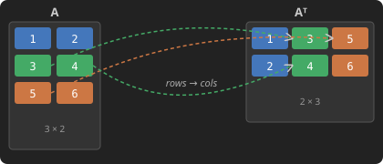

# Matrix Transpose

> Follow the [LeetGPU repository](https://github.com/HaoyangPing0324/LeetGPU) for more.

## Problem Description

[LeetGPU Challenge](https://leetgpu.com/challenges/matrix-transpose)

Write a program that transposes a matrix of 32-bit floating point numbers on a GPU. The transpose of a matrix switches its rows and columns. Given a matrix $A$ of dimensions $rows \times cols$, the transpose $A^T$ will have dimensions $cols \times rows$. All matrices are stored in row-major format.

### Implementation Requirements

- Use only native features (external libraries are not permitted)
- The `solve` function signature must remain unchanged
- The final result must be stored in the matrix `output`

### Example 1:

Input: 2×3 matrix

$$ \begin{bmatrix} 1.0 & 2.0 & 3.0 \\ 4.0 & 5.0 & 6.0 \end{bmatrix} $$

Output: 3×2 matrix

$$ \begin{bmatrix} 1.0 & 4.0 \\ 2.0 & 5.0 \\ 3.0 & 6.0 \end{bmatrix} $$

### Example 2:

Input: 3×1 matrix

$$ \begin{bmatrix} 1.0 \\ 2.0 \\ 3.0 \end{bmatrix} $$

Output: 1×3 matrix

$$ \begin{bmatrix} 1.0 & 2.0 & 3.0 \end{bmatrix} $$

### Constraints

- 1 ≤ `rows`, `cols` ≤ 8192
- Input matrix dimensions: `rows` × `cols`
- Output matrix dimensions: `cols` × `rows`
- Performance is measured with `cols` = 6,000, `rows` = 7,000

## CUDA

> To be developed.

## Triton

> To be developed.

## PyTorch

> To be developed.

## References

- [LeetGPU Challenge](https://leetgpu.com/challenges/matrix-transpose)

> Follow the [LeetGPU repository](https://github.com/HaoyangPing0324/LeetGPU) for more.
