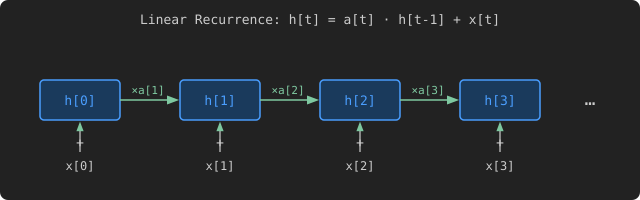

# Linear Recurrence

> Follow the [LeetGPU repository](https://github.com/HaoyangPing0324/LeetGPU) for more.

## Problem Description

[LeetGPU Challenge](https://leetgpu.com/challenges/linear-recurrence)

Given two matrices `a` and `x`, each of shape `[B, L]` (batch size × sequence length), compute the linear recurrence `h` of shape `[B, L]` defined by: `h[b, 0] = x[b, 0]` and `h[b, t] = a[b, t] × h[b, t−1] + x[b, t]` for `t ≥ 1`. All values are `float32`. This operation is the core computational primitive of State Space Models (SSMs) such as Mamba, S4, and H3.

### Implementation Requirements

- Use only native features (external libraries are not permitted)
- The `solve` function signature must remain unchanged
- The result must be stored in the output tensor `h`

### Examples

Example 1 — exponential decay (`a = 0.5`, single impulse):

$$ a = \begin{bmatrix} 0.5 & 0.5 & 0.5 & 0.5 \end{bmatrix}, \quad x = \begin{bmatrix} 1.0 & 0.0 & 0.0 & 0.0 \end{bmatrix} $$ $$ h = \begin{bmatrix} 1.0 & 0.5 & 0.25 & 0.125 \end{bmatrix} $$

Example 2 — prefix sum (`a = 1`, unit inputs):

$$ a = \begin{bmatrix} 1.0 & 1.0 & 1.0 & 1.0 \end{bmatrix}, \quad x = \begin{bmatrix} 1.0 & 1.0 & 1.0 & 1.0 \end{bmatrix} $$ $$ h = \begin{bmatrix} 1.0 & 2.0 & 3.0 & 4.0 \end{bmatrix} $$

Full example with `B = 2`, `L = 4`:

$$ a = \begin{bmatrix} 0.5 & 0.5 & 0.5 & 0.5 \\ 1.0 & 1.0 & 1.0 & 1.0 \end{bmatrix}, \quad x = \begin{bmatrix} 1.0 & 0.0 & 0.0 & 0.0 \\ 1.0 & 1.0 & 1.0 & 1.0 \end{bmatrix} $$ $$ h = \begin{bmatrix} 1.0 & 0.5 & 0.25 & 0.125 \\ 1.0 & 2.0 & 3.0 & 4.0 \end{bmatrix} $$

### Constraints

- 1 ≤ `B` ≤ 256 (batch size)
- 1 ≤ `L` ≤ 65,536 (sequence length)
- All values in `a` and `x` are `float32`
- Performance is measured with `B` = 64, `L` = 16,384

## CUDA

> To be developed.

## Triton

> To be developed.

## PyTorch

> To be developed.

## References

- [LeetGPU Challenge](https://leetgpu.com/challenges/linear-recurrence)

> Follow the [LeetGPU repository](https://github.com/HaoyangPing0324/LeetGPU) for more.
