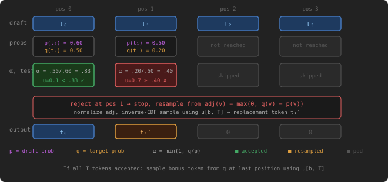

# Speculative Decoding Verification

## Problem Description

[LeetGPU Challenge](https://leetgpu.com/challenges/speculative-decoding-verification)

Implement the token verification step of speculative decoding. A draft model proposes $T$ tokens; the target model evaluates them in one forward pass and accepts or rejects each. Given $B$ sequences, produce the verified output tokens. Probability tensors are `float32`; token tensors are `int32`.

Notation for each sequence $b$, at each draft position $i = 0, \ldots, T{-}1$:

- $t_i = \texttt{draft_tokens}[b, i]$ — the token proposed by the draft model
- $p_i(v) = \texttt{draft_probs}[b, i, v]$ — draft model's probability for token $v$
- $q_i(v) = \texttt{target_probs}[b, i, v]$ — target model's probability for token $v$
- $u_i = \texttt{uniform_samples}[b, i]$ — pre-generated $U[0,1)$ sample for position $i$

For each sequence $b$, process positions $i = 0, 1, \ldots, T{-}1$ left-to-right:

1.  Compute acceptance probability: $\displaystyle \alpha_i = \min\!\left(1,\; \frac{q_i(t_i)}{p_i(t_i)}\right)$
2.  If $u_i < \alpha_i$: **accept** $t_i$, continue to position $i{+}1$.
3.  If $u_i \ge \alpha_i$: **reject**, stop. Sample replacement from: $$
    \text{adj}(v) = \frac{\max(0,\; q_i(v) - p_i(v))}{\sum_{v'} \max(0,\; q_i(v') - p_i(v'))}
    $$ using inverse CDF with $r = \texttt{uniform_samples}[b, T]$. If $\text{adj}$ is all zeros, use uniform $1/V$.
4.  If all $T$ tokens accepted: sample a **bonus token** from $q_{T-1}$ using $\texttt{uniform_samples}[b, T]$.

Write results into `output_tokens[b, :]` (shape $[B, T{+}1]$): accepted/resampled tokens fill positions $0$ through the accepted count (inclusive), remaining positions are zero.

### Implementation Requirements

- Implement `solve(draft_tokens, draft_probs, target_probs, uniform_samples, output_tokens, B, T, V)`.
- Do not change the function signature or use external libraries beyond the standard GPU frameworks.
- Write results into the provided `output_tokens` buffer (shape `[B, T+1]`, `int32`).
- Memory layout is row-major: `draft_probs[b, i, v]` is at offset `b*T*V + i*V + v`.
- Inverse CDF sampling: given distribution $\text{adj}$ (already normalized), find the smallest index $k$ where $\sum_{v=0}^{k} \text{adj}(v) \ge r$, where $r = \texttt{uniform_samples}[b, T]$. Clamp the result to $[0, V-1]$.
- If the adjusted distribution is all zeros (i.e., $q_i \le p_i$ everywhere), fall back to the uniform distribution over $V$ tokens.

### Example

Input: $B = 1,\; T = 3,\; V = 4$

$\text{draft_tokens} = [1, 2, 0]$

Draft probabilities $p_i$ and target probabilities $q_i$ per position: $$ p_0 = \begin{bmatrix} 0.10 & 0.60 & 0.20 & 0.10 \end{bmatrix}, \quad q_0 = \begin{bmatrix} 0.10 & 0.50 & 0.20 & 0.20 \end{bmatrix} $$ $$ p_1 = \begin{bmatrix} 0.10 & 0.20 & 0.50 & 0.20 \end{bmatrix}, \quad q_1 = \begin{bmatrix} 0.30 & 0.20 & 0.20 & 0.30 \end{bmatrix} $$ $$ \text{uniform_samples} = \begin{bmatrix} 0.50 & 0.70 & 0.30 & 0.90 \end{bmatrix} $$

**Position 0** (draft token = 1): $\alpha_0 = \min\!\left(1,\, \frac{q_0(1)}{p_0(1)}\right) = \min\!\left(1,\, \frac{0.50}{0.60}\right) \approx 0.833$. Since $u_0 = 0.50 < 0.833$, **accept** token 1.

**Position 1** (draft token = 2): $\alpha_1 = \min\!\left(1,\, \frac{q_1(2)}{p_1(2)}\right) = \min\!\left(1,\, \frac{0.20}{0.50}\right) = 0.40$. Since $u_1 = 0.70 \ge 0.40$, **reject**. Resample from adjusted distribution: $$ \text{adj}(v) = \max(0,\\ q_1(v) - p_1(v)) = \[0.20,\\ 0,\\ 0,\\ 0.10\] $$ $$ \text{normalized} = \left\[\tfrac{2}{3},\\ 0,\\ 0,\\ \tfrac{1}{3}\right\], \quad \text{CDF} = \[0.667,\\ 0.667,\\ 0.667,\\ 1.0\] $$ With $r = \text{uniform_samples}[0, T] = 0.90$, inverse CDF gives token **3**.

Output: $$
\text{output_tokens} = \begin{bmatrix} 1 & 3 & 0 & 0 \end{bmatrix}
$$

### Constraints

- 1 ≤ `B` ≤ 256
- 1 ≤ `T` ≤ 16
- 2 ≤ `V` ≤ 131,072
- `draft_probs[b, i, :]` and `target_probs[b, i, :]` are valid probability distributions (non-negative, sum to 1)
- `draft_probs[b, i, draft_tokens[b, i]]` \> 0 for all `b`, `i`
- `uniform_samples` values are in $[0, 1)$
- All floating-point tensors use `float32`; token tensors use `int32`
- Performance is measured with `B` = 64, `T` = 8, `V` = 32,768

## CUDA

> To be developed.

## Triton

> To be developed.

## CuTe DSL

> To be developed.

## References

- [LeetGPU Challenge](https://leetgpu.com/challenges/speculative-decoding-verification)
