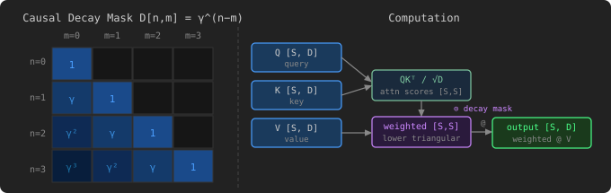

# Decaying Causal Attention

## Problem Description

[LeetGPU Challenge](https://leetgpu.com/challenges/decaying-causal-attention)

Implement decaying causal attention. Given query matrix `Q`, key matrix `K`, and value matrix `V`, each of shape `seq_len × d_model`, and a scalar decay factor `gamma` ∈ (0, 1\], compute the unnormalized causal attention output where position `n` attends to all past positions `m ≤ n` with weight `gamma``n−m`:

$$ \text{output}\[n\] = \sum\_{m=0}^{n} \gamma^{n-m} \cdot \frac{Q\[n\] \cdot K\[m\]}{\sqrt{d\_{\text{model}}}} \cdot V\[m\] $$

Unlike standard softmax attention, there is no normalization — the weights decay geometrically from the current position backward. This is the parallel form of the Retention mechanism (RetNet), used as a recurrence-friendly alternative to attention in sequence models.

### Implementation Requirements

- Implement the `solve` function; do not change its signature.
- Do not use external libraries beyond those provided.
- Write the result into `output`.

### Example

Example 1 — with `seq_len` = 2, `d_model` = 4, `gamma` = 0.5:

$$ Q = \begin{bmatrix} 1 & 1 & 0 & 0 \\ 1 & 1 & 0 & 0 \end{bmatrix}, \quad K = \begin{bmatrix} 1 & 0 & 0 & 0 \\ 0 & 1 & 0 & 0 \end{bmatrix}, \quad V = \begin{bmatrix} 4 & 8 & 12 & 16 \\ 4 & 8 & 12 & 16 \end{bmatrix} $$

Attention scores $QK^\top / \sqrt{4}$: $$ A = \begin{bmatrix} 0.5 & 0.5 \\ 0.5 & 0.5 \end{bmatrix} $$ Causal decay mask $D_{nm} = 0.5^{n-m}$ for $n \ge m$, else $0$: $$ D = \begin{bmatrix} 1 & 0 \\ 0.5 & 1 \end{bmatrix} $$ Weighted attention $A \odot D$: $$ \begin{bmatrix} 0.5 & 0 \\ 0.25 & 0.5 \end{bmatrix} $$ Output $(A \odot D)\,V$: $$ \text{output} = \begin{bmatrix} 2 & 4 & 6 & 8 \\ 3 & 6 & 9 & 12 \end{bmatrix} $$

### Constraints

- 1 ≤ `seq_len` ≤ 8,192
- 1 ≤ `d_model` ≤ 256
- 0 \< `gamma` ≤ 1
- All tensors are `float32` on GPU.
- Performance is measured with `seq_len` = 4,096, `d_model` = 64

## CUDA

> To be developed.

## Triton

> To be developed.

## CuTe DSL

> To be developed.

## References

- [LeetGPU Challenge](https://leetgpu.com/challenges/decaying-causal-attention)
