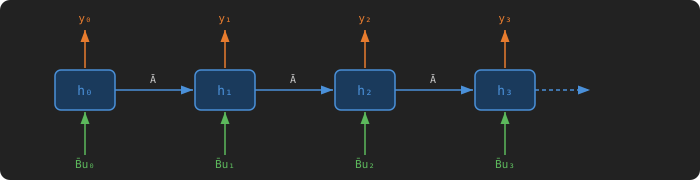

# SSM Selective Scan

> Follow the [LeetGPU repository](https://github.com/HaoyangPing0324/LeetGPU) for more.

## Problem Description

[LeetGPU Challenge](https://leetgpu.com/challenges/ssm-selective-scan)

Implement the forward pass of a State Space Model (SSM) selective scan, the core operation in Mamba-style sequence models. Given an input sequence `u`, time-step parameters `delta`, state-transition matrix `A`, input projection `B`, output projection `C`, and skip-connection weights `skip`, compute the output sequence `y` in float32.

### Implementation Requirements

Implement the function `solve(u, delta, A, B, C, skip, y, batch, seq_len, d_model, d_state)` with the signature unchanged. Do not use external libraries beyond the allowed framework. Write the result into the pre-allocated output tensor `y`.

For each batch `b`, position `t`, and channel `d`, the computation is:

$$ \bar{A}\_{b,t,d,n} = \exp(\Delta\_{b,t,d} \cdot A\_{d,n}) $$ $$ \bar{B}\_{b,t,d,n} = \Delta\_{b,t,d} \cdot B\_{b,t,n} $$ $$ h\_{b,t,d,n} = \bar{A}\_{b,t,d,n} \cdot h\_{b,t-1,d,n} + \bar{B}\_{b,t,d,n} \cdot u\_{b,t,d} $$ $$ y\_{b,t,d} = \sum\_{n} C\_{b,t,n} \cdot h\_{b,t,d,n} + \text{skip}\_d \cdot u\_{b,t,d} $$

The initial hidden state $h_{b,-1,d,n} = 0$ for all $b, d, n$. All channels `d` are independent: they share the same `B` and `C` projections but have separate state-transition rows in `A`.

### Example

    Input:
      u     = [[[1.0, 0.0], [0.0, 1.0], [1.0, 1.0], [0.0, 0.0]]]  shape (1,4,2)
      delta = [[[1.0, 1.0], [1.0, 1.0], [1.0, 1.0], [1.0, 1.0]]]  shape (1,4,2)
      A     = [[-0.5, -1.0], [-0.5, -1.0]]                         shape (2,2)
      B     = [[[1.0, 0.0], [0.0, 1.0], [1.0, 1.0], [0.5, 0.5]]]  shape (1,4,2)
      C     = [[[1.0, 0.0], [0.0, 1.0], [1.0, 1.0], [0.5, 0.5]]]  shape (1,4,2)
      skip  = [0.0, 0.0]                                            shape (2,)
      batch=1, seq_len=4, d_model=2, d_state=2

    Derivation (delta=1 everywhere, so A_bar_dn = exp(A_dn)):
      A_bar[d=0] = [exp(-0.5), exp(-1.0)] ≈ [0.607, 0.368]
      A_bar[d=1] = [exp(-0.5), exp(-1.0)] ≈ [0.607, 0.368]

      Hidden state h has shape (d_model=2, d_state=2); initial h = zeros.
      t=0: h = [[1.000, 0.000], [0.000, 0.000]]  →  y[0,0] = [1.000, 0.000]
      t=1: h = [[0.607, 0.000], [0.000, 1.000]]  →  y[0,1] = [0.000, 1.000]
      t=2: h = [[1.368, 1.000], [1.000, 1.368]]  →  y[0,2] = [2.368, 2.368]
      t=3: h = [[0.830, 0.368], [0.607, 0.503]]  →  y[0,3] = [0.599, 0.555]

    Output:
      y = [[[1.000, 0.000], [0.000, 1.000], [2.368, 2.368], [0.599, 0.555]]]

### Constraints

- 1 ≤ `batch` ≤ 16
- 1 ≤ `seq_len` ≤ 8,192
- 1 ≤ `d_model` ≤ 2,048
- 1 ≤ `d_state` ≤ 64
- All entries of `delta` are positive
- All entries of `A` are negative (ensuring `A_bar ∈ (0, 1)`)
- All tensors are float32 on the GPU
- Performance is measured with `batch` = 4, `seq_len` = 4,096, `d_model` = 512, `d_state` = 16

## CUDA

> To be developed.

## Triton

> To be developed.

## PyTorch

> To be developed.

## References

- [LeetGPU Challenge](https://leetgpu.com/challenges/ssm-selective-scan)

> Follow the [LeetGPU repository](https://github.com/HaoyangPing0324/LeetGPU) for more.
