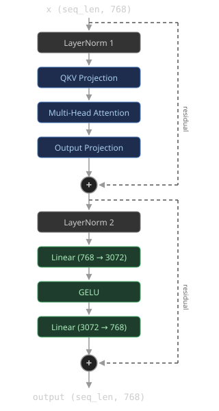

# GPT-2 Transformer Block

> Follow the [LeetGPU repository](https://github.com/HaoyangPing0324/LeetGPU) for more.

## Problem Description

[LeetGPU Challenge](https://leetgpu.com/challenges/gpt-2-transformer-block)

Implement a single GPT-2 transformer decoder block. Given an input tensor $x$ of shape `(seq_len, 768)` and a packed weight buffer containing all block parameters, compute the output using pre-norm architecture with multi-head self-attention and a feed-forward network with GELU activation.

The block uses GPT-2's **pre-norm** architecture: LayerNorm is applied *before* each sub-layer (attention and feed-forward), not after. At a high level:

$$ \begin{aligned} x' &= x + \text{MultiHeadAttn}\\\left(\text{LN}\_1(x)\right) \\ $$ 4pt\] \text{output} &= x' + \text{FeedForward}\\\left(\text{LN}\_2(x')\right) \end{aligned} $$

where the sub-layers are defined as:

$$ \begin{aligned} \text{LN}(z) &= \frac{z - \mu}{\sqrt{\sigma^2 + \epsilon}} \odot \gamma + \beta, \quad \mu = \frac{1}{d}\sum_i z_i, \quad \sigma^2 = \frac{1}{d}\sum_i (z_i - \mu)^2 \\ $$
8pt]
[Q \mid K \mid V] &= \text{LN}_1(x) \cdot W_{qkv} + b_{qkv} \
$$ 4pt\] \text{head}\_i &= \text{softmax}\\\left(\frac{Q_i K_i^\top}{\sqrt{d_k}}\right) V_i, \quad d_k = 64 \\ $$
4pt]
\text{MultiHeadAttn}(z) &= \text{Concat}(\text{head}_1, \ldots, \text{head}_{12}) \cdot W_{\text{attn}} + b_{\text{attn}} \
$$ 8pt\] \text{FeedForward}(z) &= \text{GELU}\\\left(z \cdot W\_{fc} + b\_{fc}\right) \cdot W\_{\text{proj}} + b\_{\text{proj}} \end{aligned} $$

Expanding into individual steps:

1.  **Layer Norm 1:** $x_{\text{norm}} = \text{LN}_1(x)$ with parameters $\gamma_1, \beta_1$
2.  **QKV Projection:** $QKV = x_{\text{norm}} \cdot W_{qkv} + b_{qkv}$, split into $Q, K, V$ each of shape `(seq_len, 768)`
3.  **Multi-Head Attention:** Reshape $Q, K, V$ into 12 heads of dimension 64, compute per-head scaled dot-product attention (no causal mask), then concatenate heads into $A$
4.  **Output Projection:** $P = A \cdot W_{\text{attn}} + b_{\text{attn}}$
5.  **Residual 1:** $x' = x + P$
6.  **Layer Norm 2:** $h_{\text{norm}} = \text{LN}_2(x')$ with parameters $\gamma_2, \beta_2$
7.  **Feed-Forward:** $F = \text{GELU}(h_{\text{norm}} \cdot W_{fc} + b_{fc}) \cdot W_{\text{proj}} + b_{\text{proj}}$
8.  **Residual 2:** $\text{output} = x' + F$

### Implementation Requirements

- Use only native features (external libraries are not permitted)
- The `solve` function signature must remain unchanged
- The final result must be stored in the `output` tensor
- LayerNorm uses $\epsilon = 10^{-5}$
- Use the <a href="https://docs.pytorch.org/docs/stable/generated/torch.nn.GELU.html" target="_blank">GELU tanh approximation</a>: $\text{GELU}(x) = 0.5\,x\!\left(1 + \tanh\!\left(\sqrt{\tfrac{2}{\pi}}\left(x + 0.044715\,x^3\right)\right)\right)$

### Weight Layout

All block parameters are packed into a single contiguous `weights` buffer (7,087,872 floats) in the following order. Index into the buffer using the offsets below (e.g. $W_{qkv}[i][j]$ is at `weights[1536 + i * 2304 + j]`). All 2D matrices are stored in row-major order.

| Parameter               | Shape       |      Size |    Offset |
|-------------------------|-------------|----------:|----------:|
| $\gamma_1$ (LN1 weight) | (768,)      |       768 |         0 |
| $\beta_1$ (LN1 bias)    | (768,)      |       768 |       768 |
| $W_{qkv}$               | (768, 2304) | 1,769,472 |     1,536 |
| $b_{qkv}$               | (2304,)     |     2,304 | 1,771,008 |
| $W_{\text{attn}}$       | (768, 768)  |   589,824 | 1,773,312 |
| $b_{\text{attn}}$       | (768,)      |       768 | 2,363,136 |
| $\gamma_2$ (LN2 weight) | (768,)      |       768 | 2,363,904 |
| $\beta_2$ (LN2 bias)    | (768,)      |       768 | 2,364,672 |
| $W_{fc}$                | (768, 3072) | 2,359,296 | 2,365,440 |
| $b_{fc}$                | (3072,)     |     3,072 | 4,724,736 |
| $W_{\text{proj}}$       | (3072, 768) | 2,359,296 | 4,727,808 |
| $b_{\text{proj}}$       | (768,)      |       768 | 7,087,104 |

### Example

With `seq_len` = 4, `x` uniformly drawn from \[−1, 1\], and weights randomly initialized (see Weight Layout for the packing structure):

    Input:  x.shape       = (4, 768)       # 4 token embeddings
            weights.shape = (7,087,872,)   # packed weight buffer
            seq_len       = 4
    Output: output.shape  = (4, 768)       # transformed token embeddings

### Constraints

- `d_model` = 768, `n_heads` = 12, `ffn_dim` = 3,072 (GPT-2 124M architecture)
- 1 ≤ `seq_len` ≤ 4,096
- All tensors use 32-bit floating point
- Performance is measured with `seq_len` = 1,024

## CUDA

> To be developed.

## Triton

> To be developed.

## PyTorch

> To be developed.

## References

- [LeetGPU Challenge](https://leetgpu.com/challenges/gpt-2-transformer-block)

> Follow the [LeetGPU repository](https://github.com/HaoyangPing0324/LeetGPU) for more.
