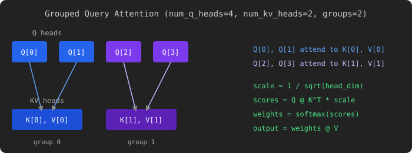

# Grouped Query Attention

[Original LeetGPU Challenge](https://leetgpu.com/challenges/grouped-query-attention)

Implement Grouped Query Attention (GQA), the attention mechanism used in modern large language models such as LLaMA-3, Mistral, and Gemma. GQA reduces the KV-cache memory footprint during inference by sharing key and value heads across groups of query heads. Given query tensor `Q` with `num_q_heads` heads and key/value tensors `K`, `V` each with `num_kv_heads` heads, compute scaled dot-product attention where every group of `num_q_heads / num_kv_heads` consecutive query heads attends to the same key and value head. All tensors use `float32`.

### Implementation Requirements

- Implement the function `solve(Q, K, V, output, num_q_heads, num_kv_heads, seq_len, head_dim)`.
- Do not change the function signature or use external libraries beyond the standard GPU frameworks.
- Write the result into the provided `output` buffer.
- `num_q_heads` is always divisible by `num_kv_heads`.
- Use scaled dot-product attention with scale factor `1 / sqrt(head_dim)` and a softmax over the key dimension.

### Example

With `num_q_heads` = 4, `num_kv_heads` = 2 (groups of 2), `seq_len` = 3, `head_dim` = 4:

**Input:**  
$Q_0$ (3×4): $$ \begin{bmatrix} 1 & 0 & 0 & 1 \\ 0 & 1 & 1 & 0 \\ 1 & 1 & 0 & 0 \end{bmatrix} $$ $Q_1$ (3×4): $$ \begin{bmatrix} 0 & 1 & 0 & 1 \\ 1 & 0 & 1 & 0 \\ 0 & 0 & 1 & 1 \end{bmatrix} $$ $Q_2$ (3×4): $$ \begin{bmatrix} -1 & 0 & 0.5 & 0 \\ 0 & -1 & 0 & 0.5 \\ 0.5 & 0 & -1 & 0 \end{bmatrix} $$ $Q_3$ (3×4): $$ \begin{bmatrix} 0 & 0.5 & 0 & -1 \\ 0.5 & 0 & 0 & -1 \\ 0 & 0 & 0.5 & 0.5 \end{bmatrix} $$ $K_0$ (3×4): $$ \begin{bmatrix} 1 & 0 & 1 & 0 \\ 0 & 1 & 0 & 1 \\ 1 & 1 & 1 & 1 \end{bmatrix} $$ $K_1$ (3×4): $$ \begin{bmatrix} 0 & 1 & 0 & -1 \\ -1 & 0 & 1 & 0 \\ 0 & -1 & 0 & 1 \end{bmatrix} $$ $V_0$ (3×4): $$ \begin{bmatrix} 1 & 2 & 3 & 4 \\ 5 & 6 & 7 & 8 \\ 9 & 10 & 11 & 12 \end{bmatrix} $$ $V_1$ (3×4): $$ \begin{bmatrix} -1 & -2 & -3 & -4 \\ 2 & 3 & 4 & 5 \\ 6 & 7 & 8 & 9 \end{bmatrix} $$ Groups: $Q_0, Q_1 \to K_0, V_0$; \quad $Q_2, Q_3 \to K_1, V_1$

**Output** (values rounded to 2 decimal places):  
$\text{output}_0$ (3×4): $$ \begin{bmatrix} 5.71 & 6.71 & 7.71 & 8.71 \\ 5.71 & 6.71 & 7.71 & 8.71 \\ 5.71 & 6.71 & 7.71 & 8.71 \end{bmatrix} $$ $\text{output}_1$ (3×4): $$ \begin{bmatrix} 6.07 & 7.07 & 8.07 & 9.07 \\ 5.00 & 6.00 & 7.00 & 8.00 \\ 5.71 & 6.71 & 7.71 & 8.71 \end{bmatrix} $$ $\text{output}_2$ (3×4): $$ \begin{bmatrix} 2.24 & 2.76 & 3.27 & 3.79 \\ 3.96 & 4.70 & 5.44 & 6.17 \\ 2.40 & 2.60 & 2.79 & 2.98 \end{bmatrix} $$ $\text{output}_3$ (3×4): $$ \begin{bmatrix} 0.76 & 0.58 & 0.40 & 0.22 \\ 1.17 & 1.08 & 1.00 & 0.91 \\ 2.84 & 3.37 & 3.91 & 4.44 \end{bmatrix} $$

### Constraints

- 1 ≤ `num_kv_heads` ≤ `num_q_heads` ≤ 64
- `num_q_heads` is divisible by `num_kv_heads`
- 1 ≤ `seq_len` ≤ 4,096
- 8 ≤ `head_dim` ≤ 256; `head_dim` is a multiple of 8
- All tensor values are `float32`
- Performance is measured with `num_q_heads` = 32, `num_kv_heads` = 8, `seq_len` = 1,024, `head_dim` = 128
