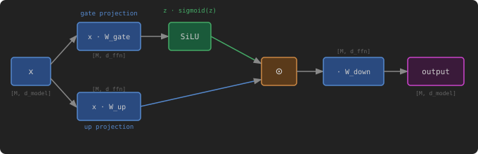

# SwiGLU MLP Block

[Original LeetGPU Challenge](https://leetgpu.com/challenges/swiglu-mlp-block)

Implement the SwiGLU MLP block — the feedforward network used in LLaMA, Mistral, Gemma, and most modern large language models. Given an input matrix `x` of shape `[M, d_model]` and three weight matrices `W_gate`, `W_up` (each `[d_model, d_ffn]`), and `W_down` (`[d_ffn, d_model]`), compute: `output = (SiLU(x × W_gate) ⊙ (x × W_up)) × W_down`, where `SiLU(z) = z × sigmoid(z)` and `⊙` denotes element-wise multiplication. All tensors are `float32`.

### Implementation Requirements

- Implement the `solve` function with the signature unchanged.
- Do not use external libraries beyond the framework provided.
- Write the result into `output` in-place.

### Example

Input: `M` = 2, `d_model` = 2, `d_ffn` = 4

$x$ (float32, $2 \times 2$): $$ x = \begin{bmatrix} 1.0 & 0.0 \\ 0.0 & 1.0 \end{bmatrix} $$ $W_\text{gate}$ and $W_\text{up}$ (both $2 \times 4$): $$ W\_\text{gate} = W\_\text{up} = \begin{bmatrix} 1.0 & 0.0 & 0.0 & 0.0 \\ 0.0 & 1.0 & 0.0 & 0.0 \end{bmatrix} $$ $W_\text{down}$ ($4 \times 2$): $$ W\_\text{down} = \begin{bmatrix} 1.0 & 0.0 \\ 0.0 & 1.0 \\ 0.0 & 0.0 \\ 0.0 & 0.0 \end{bmatrix} $$

Intermediate steps: $$ \text{gate} = x \cdot W\_\text{gate} = \begin{bmatrix} 1.0 & 0.0 & 0.0 & 0.0 \\ 0.0 & 1.0 & 0.0 & 0.0 \end{bmatrix} $$ $$ \text{up} = x \cdot W\_\text{up} = \begin{bmatrix} 1.0 & 0.0 & 0.0 & 0.0 \\ 0.0 & 1.0 & 0.0 & 0.0 \end{bmatrix} $$ $$ \text{SiLU}(1.0) = 1.0 \times \sigma(1.0) \approx 0.7311 $$ $$ \text{hidden} = \text{SiLU}(\text{gate}) \odot \text{up} = \begin{bmatrix} 0.7311 & 0.0 & 0.0 & 0.0 \\ 0.0 & 0.7311 & 0.0 & 0.0 \end{bmatrix} $$

Output: $$ \text{output} = \text{hidden} \cdot W\_\text{down} \approx \begin{bmatrix} 0.7311 & 0.0 \\ 0.0 & 0.7311 \end{bmatrix} $$

### Constraints

- 1 ≤ `M` ≤ 65,536
- 1 ≤ `d_model` ≤ 8,192
- 1 ≤ `d_ffn` ≤ 32,768
- All tensors are `float32` on the GPU.
- Input values are in the range \[-10, 10\].
- Performance is measured with `M` = 512, `d_model` = 4,096, `d_ffn` = 14,336
