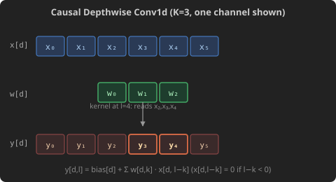

# Causal Depthwise Conv1d

[Original LeetGPU Challenge](https://leetgpu.com/challenges/causal-depthwise-conv1d)

Implement a **causal depthwise 1D convolution** over a batched sequence tensor `x` of shape `(B, L, D)`, producing an output of the same shape. In a depthwise convolution, each channel `d` is convolved independently using its own kernel `weight[d, :]` — there is no mixing across channels. The convolution is **causal**: output position `l` may only depend on input positions `0, 1, …, l` (past and present), never future positions. This operation is a key component of state-space models such as Mamba, where it is applied before the selective scan to mix local context within each feature channel.

Formally, for each batch element `b`, sequence position `l`, and channel `d`:

$$ \text{output}\[b,\\ l,\\ d\] = \text{bias}\[d\] + \sum\_{k=0}^{K-1} \text{weight}\[d,\\ k\] \cdot x\[b,\\ l - k,\\ d\] $$

where positions `l − k < 0` are treated as zero (zero-pad the left boundary). The tensor layout is **channels-last**: `x[b, l, d]` is stored at offset `b × L × D + l × D + d`.

### Implementation Requirements

- The `solve` function signature must remain unchanged
- The result must be written into the `output` tensor
- Use only native features (external libraries are not permitted)
- Input positions before the start of the sequence (i.e. indices `l − k < 0`) must be treated as zero

### Example

With `B` = 1, `L` = 4, `D` = 2, `K` = 3:

    x      = [[[1.0, 2.0],    # l=0
               [3.0, 4.0],    # l=1
               [5.0, 6.0],    # l=2
               [7.0, 8.0]]]   # l=3   shape (1, 4, 2)

    weight = [[ 1.0,  0.0, -1.0],   # channel d=0
              [ 1.0,  1.0,  1.0]]   # channel d=1   shape (2, 3)

    bias   = [0.0, 0.0]

    output = [[[1.0,  2.0],   # l=0: d0: 1*1=1          d1: 1*2=2
               [3.0,  6.0],   # l=1: d0: 3*1+1*0=3      d1: 4*1+2*1=6
               [4.0, 12.0],   # l=2: d0: 5*1+3*0+1*(-1)=4  d1: 6+4+2=12
               [4.0, 18.0]]]  # l=3: d0: 7*1+5*0+3*(-1)=4  d1: 8+6+4=18

### Constraints

- 1 ≤ `B` ≤ 16 (batch size)
- 1 ≤ `L` ≤ 8,192 (sequence length)
- 1 ≤ `D` ≤ 8,192 (number of channels)
- 1 ≤ `K` ≤ 8 (kernel size; typically 3 or 4 in practice)
- All tensors use 32-bit floating point
- Tensor `x` and `output` use channels-last layout: shape `(B, L, D)`
- Performance is measured with `B` = 8, `L` = 2,048, `D` = 4,096, `K` = 4
