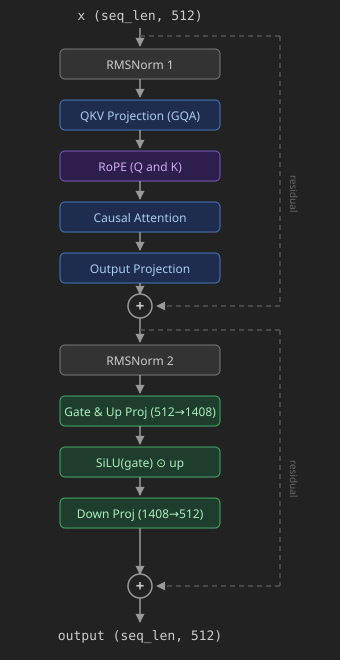

# Llama Transformer Block

[Original LeetGPU Challenge](https://leetgpu.com/challenges/llama-transformer-block)

Implement a single Llama-style transformer decoder block. Given an input tensor $x$ of shape `(seq_len, 512)`, a packed weight buffer, and precomputed RoPE tables, compute the output using pre-norm architecture with Grouped Query Attention (GQA), Rotary Position Embeddings (RoPE), and a SwiGLU feed-forward network.

The block follows Llama's **pre-norm** architecture. Unlike GPT-2, it uses **RMSNorm** (no mean subtraction, no additive bias), **Grouped Query Attention** with 8 query heads and 2 key/value heads, **Rotary Position Embeddings** applied to Q and K, and a **SwiGLU** feed-forward network. None of the linear projections have bias terms.

$$ \begin{aligned} x' &= x + \text{Attn}\\\left(\text{RMSNorm}\_1(x),\\ \cos,\\ \sin\right) \\ $$ 4pt\] \text{output} &= x' + \text{FFN}\\\left(\text{RMSNorm}\_2(x')\right) \end{aligned} $$

The sub-operations in detail:

$$ \begin{aligned} \text{RMSNorm}(z, w) &= \frac{z}{\sqrt{\frac{1}{d}\sum_i z_i^2 + \varepsilon}} \odot w, \quad \varepsilon = 10^{-5} \\ $$
8pt]
Q &= \text{RMSNorm}_1(x)\, W_Q^\top \in \mathbb{R}^{T \times 512}, \quad \text{reshape to } (T, 8, 64) \
$$ 4pt\] K &= \text{RMSNorm}\_1(x)\\ W_K^\top \in \mathbb{R}^{T \times 128}, \quad \text{reshape to } (T, 2, 64) \\ $$
4pt]
V &= \text{RMSNorm}_1(x)\, W_V^\top \in \mathbb{R}^{T \times 128}, \quad \text{reshape to } (T, 2, 64) \
$$ 8pt\] \text{RoPE}(q, \cos, \sin) &: \quad \[q_1 \mid q_2\] \mapsto \[q_1 \odot \cos - q_2 \odot \sin \mid q_1 \odot \sin + q_2 \odot \cos\] \\ $$
4pt]
&\quad q_1 = q[\ldots, {:}32],\; q_2 = q[\ldots, {32:}] \
$$ 8pt\] \text{GQA} &: \text{repeat } K,V \text{ along head dim } 4\times \text{ to match 8 Q heads} \\ $$
4pt]
\text{head}_i &= \text{softmax}\!\left(\frac{Q_i K_i^\top}{\sqrt{64}} + M_{\text{causal}}\right) V_i \
$$ 8pt\] \text{Attn}(x) &= \text{Concat}(\text{head}\_1, \ldots, \text{head}\_8)\\ W_O^\top \\ $$ 8pt\] \text{FFN}(z) &= \bigl(\text{SiLU}(z\\ W\_{\text{gate}}^\top) \odot z\\ W\_{\text{up}}^\top\bigr)\\ W\_{\text{down}}^\top \end{aligned} $$

where $M_{\text{causal}}$ is the upper-triangular causal mask ($-\infty$ above the diagonal) and $\text{SiLU}(x) = x \cdot \sigma(x)$.

### Implementation Requirements

- Use only native features (external libraries are not permitted)
- The `solve` function signature must remain unchanged
- The final result must be stored in the `output` tensor
- RMSNorm uses $\varepsilon = 10^{-5}$, no additive bias
- Apply causal masking: position $i$ attends only to positions $\le i$
- Repeat K and V heads $4\times$ (GQA groups) before computing attention
- `cos` and `sin` have shape `(seq_len, 32)` — apply them to both Q and K heads independently

### Weight Layout

All parameters are packed into a single contiguous `weights` buffer (2,819,072 floats) in the order below. All 2-D matrices are stored row-major with shape `(out_dim, in_dim)`. There are no bias terms.

| Parameter               | Shape       |    Size |    Offset |
|-------------------------|-------------|--------:|----------:|
| $w_1$ (RMSNorm 1 scale) | (512,)      |     512 |         0 |
| $W_Q$                   | (512, 512)  | 262,144 |       512 |
| $W_K$                   | (128, 512)  |  65,536 |   262,656 |
| $W_V$                   | (128, 512)  |  65,536 |   328,192 |
| $W_O$                   | (512, 512)  | 262,144 |   393,728 |
| $w_2$ (RMSNorm 2 scale) | (512,)      |     512 |   655,872 |
| $W_{\text{gate}}$       | (1408, 512) | 720,896 |   656,384 |
| $W_{\text{up}}$         | (1408, 512) | 720,896 | 1,377,280 |
| $W_{\text{down}}$       | (512, 1408) | 720,896 | 2,098,176 |

### Example

With `seq_len` = 4, `x` drawn uniformly from \[−1, 1\], and randomly initialized weights:

    Input:  x.shape       = (4, 512)       # 4 token hidden states
            weights.shape = (2,819,072,)   # packed weight buffer
            cos.shape     = (4, 32)        # precomputed RoPE cosines
            sin.shape     = (4, 32)        # precomputed RoPE sines
            seq_len       = 4
    Output: output.shape  = (4, 512)       # transformed token hidden states

### Constraints

- `d_model` = 512, `n_q_heads` = 8, `n_kv_heads` = 2, `head_dim` = 64, `ffn_hidden` = 1,408
- 1 ≤ `seq_len` ≤ 4,096
- All tensors use 32-bit floating point
- Performance is measured with `seq_len` = 2,048
